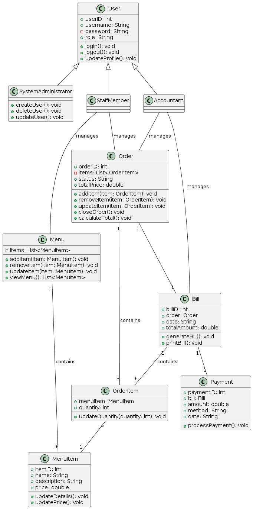
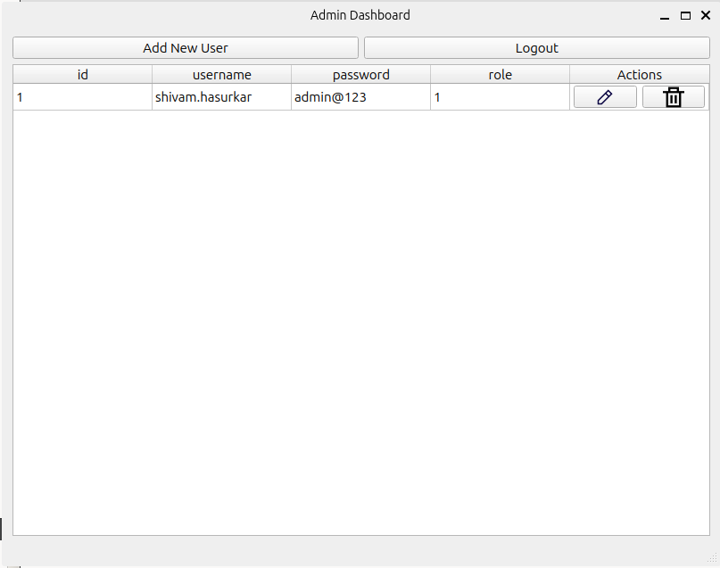
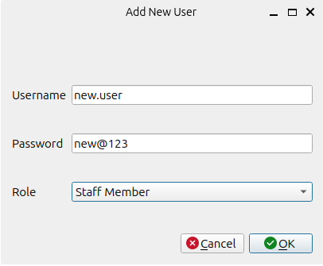
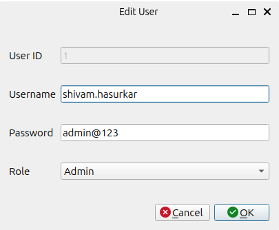

# Fullstack Alchemists - Restaurant Billing System

### Team members

-   Aditi Patil (017454164)
-   Vijitha Gunta (017427618)
-   Shivam Hasurkar (017413214)
-   Aditya Kulkarni (016904537)

## Project description

This project involves the development of a comprehensive restaurant management system designed to streamline various operational aspects of a dining establishment. The system is structured around four core modules: User Management, Menu Management, Order Management, and Billing and Payment. Each module is supported by a set of dedicated classes that handle specific functionalities, ensuring efficient management of restaurant operations.

## Requirement specification

### Functional requirements

-   User Management: The system should allow for the creation, modification, and deletion of user accounts for staff members.

-   Menu Management: The system should enable staff to add, update, and remove menu items, including their prices and descriptions.

-   Order Management: The system should allow staff to create, update, and close customer orders, as well as add and remove items from an order.

-   Billing and Payment: The system should be able to generate bills for completed orders and support various payment methods (cash, credit card, etc.).

### Non functional requirements

-   Usability: The system should have an intuitive and user-friendly interface for quick and efficient operation.

-   Performance: The system should be able to handle multiple orders simultaneously without significant delays.

-   Scalability: The system should be able to scale to accommodate growth in the number of users and menu items.

-   Security: The system should protect sensitive information, such as customer payment details and staff login credentials.

-   Reliability: The system should have minimal downtime and be able to recover quickly from failures.

## Project classes

##### Class diagram



##### User management:

Purpose: Handles user authentication and the management of user profiles.

Key Classes:

-   User: Base class for all user types, managing common attributes like userID, username, and role.
-   SystemAdministrator: Inherits from User, with capabilities to create, update, and delete user accounts.
-   StaffMember: Inherits from User, interacts with menu and order management tasks.
-   Accountant: Inherits from User, responsible for managing financial transactions and billing.

##### Menu management:

Purpose: Manages all aspects related to the restaurant’s menu, including item listings and pricing.

Key Classes:

-   MenuItem: Represents individual dishes or items, holding details like name, description, and price.

-   Menu: Aggregates MenuItem objects and provides methods to add, remove, or update menu items.

##### Order management:

Purpose: Facilitates order processing, from creation to closure.

Key Classes:

-   OrderItem: Links directly to MenuItem and includes quantity for order-specific details.

-   Order: Manages collections of OrderItem, tracks order status, and computes total price.

##### Billing and payment:

Purpose: Handles the generation of bills and processing of payments post-order finalization.

Key Classes:

-   Bill: Associated with an Order, detailing the total amount due and other billing information.

-   Payment: Links to Bill and handles transaction details like payment method and amount.

## System flow

The system allows staff members to manage the menu and orders directly, while accountants focus on the financial aspects, such as billing and payments. System administrators oversee user account management, ensuring that only authorized personnel have access to the system. This separation of duties not only enhances security but also improves operational efficiency by assigning specific roles and responsibilities.

This project aims to provide a robust and user-friendly platform to support the daily operations of restaurants, enhancing both customer service and internal management processes.

## Key use case - user management

For this prototype, we will be showcasing the User Management use case. For this use case, the primary actor is the System Administrator who can perform CRUD operations for all types of users (Admin, Staff Member and Accountant). Kindly refer to the class diagram and classes description mentions above for details.

### GUI for user management

|                                                           |                           |                             |
| :-------------------------------------------------------: | :-----------------------: | :-------------------------: |
|  |  |  |
|                                                           |                           |                             |

### What is happening?

-   As shown in the first image, when a System Administrator logs in, he/she is presented with the Admin Dashboard Screen. This screen lists all the existing users in the system. This satisfies the read user operation from the User Management use case.
-   The System Administrator can edit existing user's information or delete any existing user by clicking the edit or delete icon buttons respectively which satisfies the edit and delete operations from the User Management use case. The second image shows a screenshot of the Edit User dialog presented when the edit button is clicked. This dialog is pre-populated with the existing user's information.
-   When the System Administrator clicks on the Add New User button on the Dashboard screen, the Add New User dialog is presented. This satisfies the create operation from the User Management use case.

## Instructions for the grader

### 1. Getting started

To get started, clone [this](https://github.com/Fullstack-Alchemists-SJSU/restaurant-billing-system-qt.git) repository.

```bash
git clone https://github.com/Fullstack-Alchemists-SJSU/restaurant-billing-system-qt.git
```

This project is built using the QT Framework. If you do not have QT Creator installed, you can download it from [here](https://www.qt.io/product/development-tools). After installing QT Creator, open the cloned project in QT Creator.

### 2. Changing data file path

After opening the project in QT Creator, you need to change the file path for `users.csv` which contains the list of users. Change the file path in `util/Constants.h`.

There already is a `users.csv` file in the `db` directory. You can use that to run this project. Just change the path based on the location of the cloned project.

```c++
#ifndef CONSTANTS_H
#define CONSTANTS_H

#include <QtCore/QString>

enum class Role{
    Admin = 1,
    StaffMember = 2,
    Accountant = 3
};

class Constants{
public:
    inline static const QString USER_FILE = "fully_qualified_path_to_users.csv";

    // rest of the file remains unchanged
};

#endif // CONSTANTS_H
```

### 3. Run the project

After making this change, you can simply run the project using the Run button at the bottom left of QT Creator or press `CTRL+R`.
